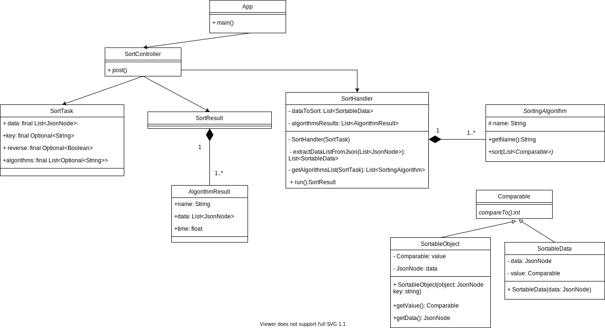

# SortingMadness
[](https://github.com/nmaszin/projekt_io/actions/workflows/ci.yml)
## Instrukcja
Aplikacja działa na porcie 8080. Aby ją uruchomić należy wykonać następującą komendę:
```bash
$ mvn spring-boot:run 
```

## Dokumentacja
Dokumentacja API znajduje się [tutaj](./docs/api.md).

## Diagram UML


